% Android
% Adolfo Sanz De Diego
% Junio 2011 - Actualizado Julio 2012

# Créditos

## Autor

**Adolfo Sanz De Diego**

-  Correo: [asanzdiego@gmail.com](mailto:asanzdiego@gmail.com)

-  Twitter: [@asanzdiego](http://twitter.com/asanzdiego)

-  Linkedin: [http://www.linkedin.com/in/asanzdiego](http://www.linkedin.com/in/asanzdiego)

-  Blog: [http://asanzdiego.blogspot.com.es](http://asanzdiego.blogspot.com.es)

## Licencia

**Este obra está bajo una licencia:**

-  [Creative Commons Reconocimiento-CompartirIgual 3.0](http://creativecommons.org/licenses/by-sa/3.0/es/)

**El código fuente de los programas están bajo una licencia:**

-  [GPL 3.0](http://www.viti.es/gnu/licenses/gpl.html)

## Cofinanciado

# Introducción

## Los inicios de Android

**2005**

-  Google adquiere **Android, Inc**.
    - Pequeña empresa que desarrolla software para móviles.

**2007**

-  Nace la **Open Handset Alliance**.
    - Consorcio de empresas (operadoras, fabricantes, software) unidas
          con el objetivo de desarrollar estándares abiertos para móviles.
    - Google, Intel, ARM, HTC, LG, Motorola, Samsumg, T-Mobile, Vodafone, etc.

**2008**

-  Publicado Android como **Open Source**:
    - Licencia Apache 2.0 + otras licencias (GPL v2 para el núcleo).

-  Se abre el **Android Market**.

-  HTC Dream (**G1**), primer teléfono con Android.

## La escalada de Android

**2009**

-  Motorola Droid vende 1 millón de unidades en 74 días
		- superando el record del iPhone de Apple.

-  **16.000 aplicaciones** en el Android Market: (66% gratuitas, 33% de pago)

**2010**

-  Se activan **cada día 300.000 nuevos** dispositivos con Android.

-  Por primera vez la venta de Adroids supera a la de iPhones en EEUU.

**2011**

-  Se activan **cada día 700.000 nuevos** dispositivos con Android.

-  **200.000 aplicaciones** en el Android Market

**2012**

-  Se activan **cada día 1 millón de nuevos** dispositivos con Android.

-  **600.000 aplicaciones** en Google Play.

## Comparativa mundial

**2011**: 
	- Android: 37%
	- iOS: 19%
	- Otros: 44%

**2012**:
	- Android: 59%
	- iOS: 23%
	- Otros: 18%

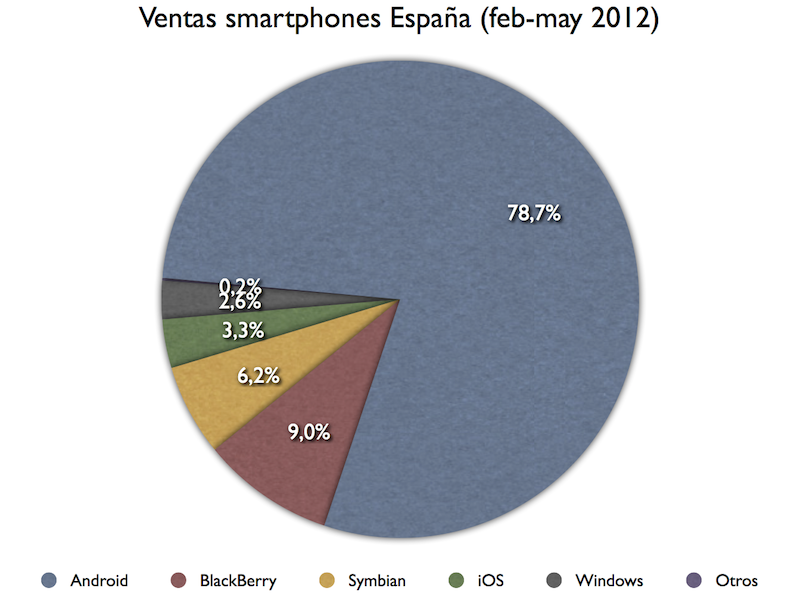

## Comparativa española (Evolución)

## ¿Qué es Android?

Es un **Sistema Operativo**, basado en el kernel de **linux**,
  diseñado para **móviles y tablets**.

No es sólo eso, es además:

-  Conjunto de aplicaciones (agenda, contactos, navegador, etc.)

-  Conjunto de bibliotecas (OpenGL, Media, SQLite, etc.)

-  Framework (Activity, Intent, Service, Broadcast receivers, Content Provider, etc.)

-  Entorno de trabajo (compilador, emulador, debuguer, etc.)

Leer [http://developer.android.com/guide/basics/what-is-android.html](http://developer.android.com/guide/basics/what-is-android.html)

## Recursos Limitados

Android está diseñado para ejecutarse en dispositivos con recursos limitados:

-  memoria, almacenamiento, CPU, pero sobre todo **batería**.

Hay que esforzarse en desarrollar bien desde el primer momento.

-  Usar herramientas como PMD, CPD, FindBugs para aprender a mejorar.

-  Leer [http://developer.android.com/guide/practices/design/performance.html](http://developer.android.com/guide/practices/design/performance.html)

Hay que esforzarse en hacer aplicaciones usables para distintos dispositivos:

-  Distintos tamaños de pantalla.

-  Distintas densidades de píxeles.

-  Distintos componentes hardware (GPS, brújula, cámara, wifi, bluetooth, etc. )

-  Leer [http://developer.android.com/guide/practices/screens_support.html](http://developer.android.com/guide/practices/screens_support.html)

## ¿Cómo se programa Android?

De forma nativa en C/C++ (bajo nivel)

En **Java**:

-  Android dispone de una máquina virtual **Dalvik** que puede ejecutar
      aplicaciones hechas en Java.

## Arquitectura

## Arquitectura - Kernel Linux

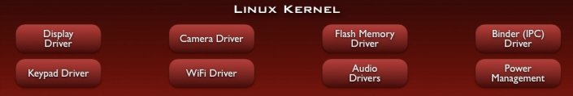

Android depende de **Linux** para los servicios base del sistema:

-  seguridad, gestión de memoria, gestión de procesos, controladores, etc.

El núcleo también actúa como una capa de abstracción entre el **hardware**
  y el resto de la pila de software.

## Arquitectura - Bibliotecas

Android incluye un conjunto de **bibliotecas de utilidades** escritas en C/C++:

-  contenidos multimedia, gráficos 2D y 3D, base de datos SQLite, etc.

## Arquitectura - Runtime

Android incluye un conjunto de **bibliotecas base** con:

-  el API casi completo de Java,

-  otras API muy usadas en entornos Java.

Cada aplicación Android corre su propio proceso independiente,
  con su propia memoria, y con su propia instancia de la máquina virtual **Dalvik**:

-  Dalvik está optimizada para requerir poca memoria.

-  Dalvik ejecuta archivos en el formato Dalvik Executable (.dex).

-  Dalvik incluye una herramienta para transformar los .class de Java a .dex

## Arquitectura - Framework

Los desarrolladores tienen acceso a los mismos APIs usados por las aplicaciones base.

El framework está diseñado para simplificar la **reutilización de componentes**:

-  cualquier aplicación puede publicar sus capacidades

-  y cualquier otra aplicación puede luego hacer uso de esas capacidades

-  (sujeto a reglas de seguridad del framework).

## Arquitectura - Aplicaciones

Las **aplicaciones** base incluyen:

-  un cliente de correo electrónico, un programa de SMS,
      un calendario, mapas, navegador, contactos y otros.

Estas aplicaciones están **disponibles** para el resto de aplicaciones.

## Versiones de Android

[http://developer.android.com/resources/dashboard/platform-versions.html](http://developer.android.com/resources/dashboard/platform-versions.html)

## Java & Android

En 1991 **James Gosling** creó una plataforma para ser usada en **pequeños dispositivos**.

En 1994 se reorientó hacia la **web**.

En 1995 **Netscape** anunció que sería soportado en sus **navegadores**.

En 1996 aparece **JDK 1.0**.

En 2001 ya es el lenguaje de programación más popular según el **índice TIOBE**.

En 2004 aparece **J2SE 5.0**

En 2006 cambia su licencia a **GPL**.

-  En 2008 se convierte en el lenguaje de programación de **Android** (versión 5.0)

En 2009 **Oracle Corporation compra Sun Microsystems**.

-  En 2010 **Oracle demanda a Google** por el uso de patentes de Java en Android.

## Entorno de Java

## Ejecución de Java

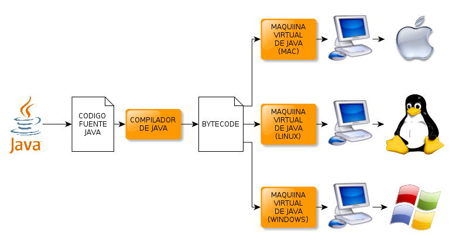

## Ejecución de otros lenguajes

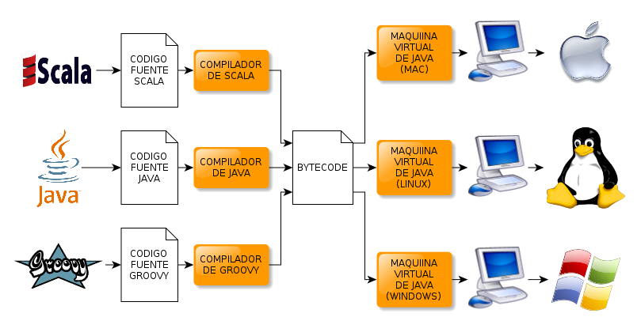

## Java VS Android

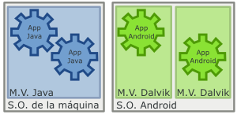

## Distintas plataformas Java

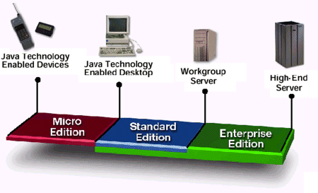

**Android** usa sus propia máquina virtual, con sus propias APIs (muy parecidas a JSE pero no al 100% pues no tiene ni AWT ni SWING)

# Instalación y Configuración

## Requisitos hardware

Sobre todo mucha **RAM**:

-  Si queremos utilizar un IDE como Eclipse y el plugin ADT de Android:
    - Windows: mínimo 3 GB, recomendable 4 GB
    - Linux: mínimo 2 GB, recomendable 3 GB

## Requisitos software

Imprescindible:

-  **JDK** (Java Development Kit)

-  **Android SDK** (Android Software Development Kit)

-  **Android SDK Components**:
    - SDK tools, SDK plataform-tools, documentation, samples.
    - SDK plataform(s) par el **AVD** (Android Virtual Device)

Recomendable:

-  **Eclipse**

-  **Plugin ADT** de Android para Eclipse

## Instalación JDK y Eclipse en Windows

Descargar el JDK de:

-  [http://www.oracle.com/technetwork/java/javase/downloads/index.html](http://www.oracle.com/technetwork/java/javase/downloads/index.html)

Instalar el JDK:

-  Siguiente, siguiente, siguiente...

Descargar "Eclipse Classic":

-  [http://eclipse.org/downloads/](http://eclipse.org/downloads/)

Descomprimir Eclipse en una carpeta:

-  Botón derecho, descomprimir...

## Instalación JDK y Eclipse en Linux

Instalar Eclipse (con su dependencia de Java -openjdk-)

~~~{.bash}
apt-get install eclipse
~~~

## Instalación del SDK en Windows

Descargar el SDK (*.exe) de:

-  [http://developer.android.com/sdk/index.html](http://developer.android.com/sdk/index.html)

Instalar el SDK:

-  Siguiente, siguiente, siguiente...

## Instalación del SDK en Linux

Descargar el SDK (*.tgz) de:

-  [http://developer.android.com/sdk/index.html](http://developer.android.com/sdk/index.html)

Descomprimir SDK en una carpeta:

-  Botón derecho, descomprimir...

## Instalación del ADT en el Eclipse

Instalar el plugin ADT (Android Development Tool) en Eclipse:

-  Abrir el Eclipse

-  **Help > Install New Software...**

-  [http://dl-ssl.google.com/android/eclipse/](http://dl-ssl.google.com/android/eclipse/)

-  Siguiente, siguiente, siguiente...

Configurar el plugin ADT (Android Development Tool) en Eclipse:

-  Abrir el Eclipse

-  **Window > Preferences > Android > SDK Location**

-  Poner la ruta completa a la carpeta del SDK

Descargas adicionales:

-  Abrir el Eclipse

-  **Window > Android SDK and AVD Manager**

-  En **Availables Packages** > seleccionar y descargar.

## Configurar un AVD

Podemos probar las aplicaciones en el emulador AVD (**Android Virtal Device**)

Para crear un AVD:

-  Abrir el Eclipse

-  **Window > Android SDK and AVD Manager**

-  En **Virtual Devices** > pinchamos en **New**:
    - Añadimos nombre descriptivo,
    - seleccionamos el target (versión) de Android,
    - seleccionamos **snapshot** para que se cargue más rápido
    - y añadimos características hardware (resolución de pantalla, cámara, GPS, etc.)

## Configuración

**Recomendable** actualizar el **PATH** con los siguintes directorios:

-  \<sdk\>/tools

-  \<sdk\>/platform-tools

En **Windows**:

-  Botón derecho en "Mi PC" > "Propiedades" > Pestaña "Avanzado" > Botón "Variables de Entorno"

-  Doble click en la variable PATH que está en "Variables del Sistema"

-  Añadir a la variable PATH la ruta completa a los directorios: <sdk>/tools y <sdk>/platform-tools

En **Linux**:

-  Editar el fichero ~/.bashrc file

-  Añadir:

~~~{.bash}
export PATH=${PATH}:<sdk>/tools:<sdk>/platform-tools
~~~

## Código fuente android.jar

Para **depurar**, si queremos también depurar las clases de android, nos hace falta
  el código fuente.

El **código fuente** se puede descargar directamente desde [http://source.android.com/](http://source.android.com/)
  pero es complicado, pues está dividido en ramas, versiones y módulos.

Lo mejor es buscar un **zip** con todos los fuentes para un target en concreto como
  por ejemplo desde [http://android.opensourceror.org/2010/01/18/android-source/](http://android.opensourceror.org/2010/01/18/android-source/).

Ese zip hay que enlazarlo al android.jar que está dentro del target android del proyecto:

-  Botón derecho en <nombre-proyecto>/<target-android>/android.jar

-  Properties

-  Java Source Attachment

-  Rellenar Location path

# Estructura General de un proyecto

## Carpetas

Cuando creamos un nuevo proyecto Android en Eclipse se genera automáticamente
  la estructura de carpetas necesaria.

Esta estructura será común a cualquier aplicación, independientemente de
  su tamaño y complejidad.

Leer [http://developer.android.com/guide/topics/resources/index.html](http://developer.android.com/guide/topics/resources/index.html)

## Carpeta src

Contiene todo el **código fuente** de la aplicación, código de la interfaz gráfica,
  clases auxiliares, etc.

## Carpeta res

Contiene todos los **ficheros de recursos** necesarios para el proyecto:

-  imágenes, vídeos, cadenas de texto, etc.

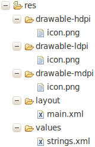

Los diferentes tipos de recursos se deberán distribuir entre las siguientes carpetas:

-  **/res/drawable/** Contienen las imágenes de la aplicación.
    - Se puede dividir en función de la resolución del dispositivo:
        - **/drawable-ldpi** para resoluciones bajas
        - **/drawable-mdpi** para resoluciones medias
        - **/drawable-hdpi** para resoluciones altas

-  **/res/layout/** Contienen los ficheros de definición de la interfaz gráfica.
    - Se puede dividir en función de la orientación del dispositivo:
        - **/layout-port** para orientaciones tipo 'portrait'
        - **/layout-land** para orientaciones tipo 'landscape'

Otra carpeta muy importante es la de **values**:

-  **/res/values/**
    - Se puede dividir por idiomas:
        - **/res/values-es/**
        - **/res/values-fr/**
    - Contiene otros recursos de la aplicación:
        - **strings.xml** para las cadenas de texto
        - **styles.xml** para los estilos
        - **colors.xml** para los colores

Hay otras carpetas menos importantes que también se pueden llegar a usar:

-  **/res/anim/** Contiene la definición de las animaciones de la aplicación.

-  **/res/menu/** Contiene la definición de los menús de la aplicación.

-  **/res/xml/** Contiene los ficheros XML utilizados por la aplicación.

-  **/res/raw/** Contiene recursos adicionales, normalmente en formato distinto a XML,
      que no se incluyan en el resto de carpetas de recursos.

Ver [http://developer.android.com/guide/topics/resources/providing-resources.html](http://developer.android.com/guide/topics/resources/providing-resources.html)

## Carpeta gen

Contiene una clase **generada automáticamente** al compilar el proyecto (no tocar),
  que referencia cada uno de los recursos de nuestra aplicación.

## Carpeta assets

Contiene todos los demás ficheros auxiliares necesarios para la aplicación,
  como ficheros de configuración, de datos, etc.

## Fichero AndroidManifest.xml

Contiene la definición de los **aspectos principales** de la aplicación,
  como por ejemplo:
  - su identificación (nombre, versión, icono, etc.),
  - sus componentes (pantallas, mensajes, etc.),
  - o los **permisos** necesarios para su ejecución.

# Componentes Principales

## Activity

Una **actividad** representa una ventana de la aplicación.

Está asociada con una vista.

Puede escuchar los eventos originados en los distintos controles gráficos.

Leer [http://developer.android.com/guide/topics/fundamentals/activities.html](http://developer.android.com/guide/topics/fundamentals/activities.html)

## Ciclo de vida de un Activity

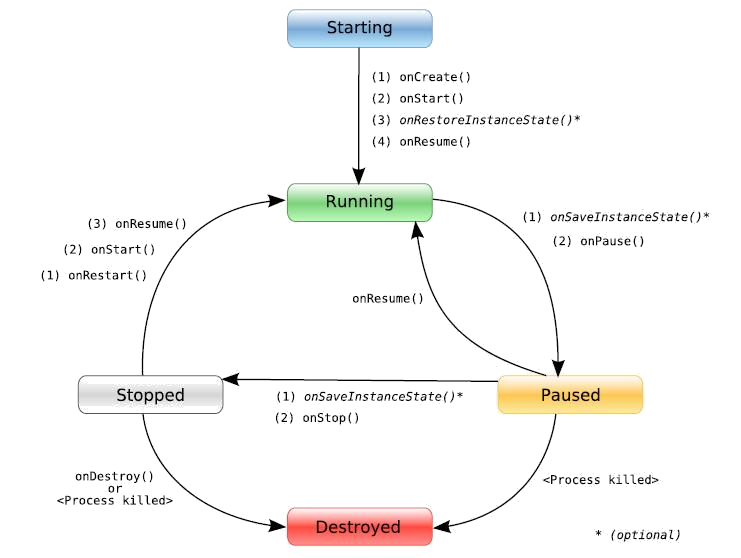

## View

Una **vista** se puede programar por código o mediante XML (aconsejable).

Existen un gran número de controles (cuadros de texto, botones, listas desplegables, etc.).

Podemos crearnos nuestros propios controles.

A los distintos controles se les puede asociar eventos.

Existen también distintos layouts (linear layout, table layout, relative layout, etc.)
  donde agrupar distintos controles.

Leer [http://developer.android.com/guide/topics/ui/index.html](http://developer.android.com/guide/topics/ui/index.html)

## Service

Un **servicio** es un componente sin interfaz gráfica que se ejecuta en segundo plano.

Leer [http://developer.android.com/guide/topics/fundamentals/services.html](http://developer.android.com/guide/topics/fundamentals/services.html)

## Content Provider

Un **proveedor de contenidos**, comparte datos con otras aplicaciones.

Leer [http://developer.android.com/guide/topics/providers/content-providers.html](http://developer.android.com/guide/topics/providers/content-providers.html)

## Broadcast Receiver

Un **receptor de difusiones**, es un componente destinado a detectar
  y reaccionar ante determinados mensajes generados por el sistema
  o por otras aplicaciones.

Leer [http://developer.android.com/reference/android/content/BroadcastReceiver.html](http://developer.android.com/reference/android/content/BroadcastReceiver.html)

## App Widget

Un **reproductor** es un elemento visual que se coloca en la pantalla principal
  del dispositivo y muestra información que puede ser actualizada periódicamente.

Leer [http://developer.android.com/guide/topics/appwidgets/index.html](http://developer.android.com/guide/topics/appwidgets/index.html)

## Intent

Un **propósito** es el elemento básico de comunicación entre los distintos
  elementos que hemos descrito anteriormente.

Son los mensajes que son enviados entre los distintos componentes de una aplicación,
  entre distintas aplicaciones o entre el sistema y otras aplicaciones.

Leer [http://developer.android.com/guide/topics/intents/intents-filters.html](http://developer.android.com/guide/topics/intents/intents-filters.html)

# Primera aplicación

## Hola Usuario

## Nuevo proyecto Android

Abrimos el Eclipse

**File > New > Other.. > Android Proyect**

Nombre "**HolaUsuario**"

Actividad **Main**

## /res/values/strings.xml

~~~{.xml}
<?xml version="1.0" encoding="utf-8"?>
<resources>
  <string name="app_name">Hola Usuario</string>
  <string name="nombre">Escribe tu nombre:</string>
  <string name="hola">Hola</string>
</resources>
~~~

## /res/layout/main.xml

~~~{.xml}
<?xml version="1.0" encoding="utf-8"?>

<LinearLayout xmlns:android="http://schemas.android.com/apk/res/android"
  android:orientation="vertical"
  android:layout_width="fill_parent"
  android:layout_height="fill_parent" >

  <TextView android:id="@+id/LblNombre"
    android:text="@string/nombre"
    android:layout_height="wrap_content"
    android:layout_width="fill_parent" />

  <EditText android:id="@+id/TxtNombre"
    android:layout_height="wrap_content"
    android:layout_width="fill_parent" />

  <Button android:id="@+id/BtnHola"
    android:text="@string/hola"
    android:layout_height="wrap_content"
    android:layout_width="wrap_content" />

</LinearLayout>
~~~

## /res/layout/saludo.xml

~~~{.xml}
<?xml version="1.0" encoding="utf-8"?>

<LinearLayout
  xmlns:android="http://schemas.android.com/apk/res/android"
  android:layout_width="wrap_content"
  android:layout_height="wrap_content">

  <TextView android:id="@+id/TxtSaludo"
    android:layout_width="wrap_content"
    android:layout_height="wrap_content" />

</LinearLayout>
~~~

## UsuarioActivity.java

~~~{.java}
public class UsuarioActivity extends Activity {

  public void onCreate(final Bundle savedInstanceState) {
    super.onCreate(savedInstanceState);
    this.setContentView(R.layout.main);

    // Localizamos los controles
    final EditText txtNombre = (EditText) this.findViewById(R.id.TxtNombre);
    final Button btnHola = (Button) this.findViewById(R.id.BtnHola);

    // Añadimos un Listener al botón
    btnHola.setOnClickListener(new OnClickListener() {

      public void onClick(final View view) {
        // Creamos el Intent
        final Intent intent = new Intent(UsuarioActivity.this, Saludo.class);

        // Creamos la información a pasar entre actividades
        final Bundle bundle = new Bundle();
        bundle.putString("NOMBRE", txtNombre.getText().toString());

        // Añadimos la información al intent
        intent.putExtras(bundle);

        // Iniciamos la nueva actividad
        UsuarioActivity.this.startActivity(intent);
      }
    });
  }
}
~~~

## Saludo.java

~~~{.java}
public class Saludo extends Activity {

  public void onCreate(final Bundle savedInstanceState) {
    super.onCreate(savedInstanceState);
    this.setContentView(R.layout.saludo);

    // Localizamos los controles
    final TextView txtSaludo = (TextView) this.findViewById(R.id.TxtSaludo);

    // Recuperamos la información pasada en el Intent
    final Bundle bundle = this.getIntent().getExtras();

    // Construimos el mensaje a mostrar
    final String mensaje = this.getString(R.string.hola) + " " + bundle.getString("NOMBRE");

    // Mostramos el mensaje
    txtSaludo.setText(mensaje);
  }
}
~~~

## AndroidManifest.xml

~~~{.xml}
<?xml version="1.0" encoding="utf-8"?>

<manifest xmlns:android="http://schemas.android.com/apk/res/android"
  package="curso.android" android:versionCode="1" android:versionName="1.0">

  <uses-sdk android:minSdkVersion="7" />

  <application android:icon="@drawable/icon" android:label="@string/app_name">

    <activity android:name=".UsuarioActivity" android:label="@string/app_name">
      <intent-filter>
        <action android:name="android.intent.action.MAIN" />
        <category android:name="android.intent.category.LAUNCHER" />
      </intent-filter>
    </activity>

    <activity android:name=".Saludo" />

  </application>

</manifest>
~~~

# Layouts

## FrameLayout

Coloca todos sus controles hijos alineados con su esquina superior izquierda,
  de forma que cada control quedará oculto por el control siguiente
  (a menos que éste último tenga transparencia).

Suele utilizarse para mostrar un único control en su interior.

Los componentes deberán establecer

-  sus propiedades:
    - **android:layout_width** y
    - **android:layout_height**

-  con los valores:
    - **fill_parent**: para que el componente tome la dimensión de su layout.
    - **wrap_content**: para que el componente tome la dimensión de su contenido.

## Ejemplo FrameLayout

~~~{.xml}
<FrameLayout
  xmlns:android="http://schemas.android.com/apk/res/android"
  android:layout_width="fill_parent"
  android:layout_height="fill_parent">

  <EditText android:id="@+id/Texto"
    android:layout_width="fill_parent"
    android:layout_height="wrap_content" />

</FrameLayout>
~~~

## LinearLayout

Apila uno tras otro los componentes de forma horizontal o vertical
  según se establezca su propiedad **android:orientation**.

Al igual que en FrameLayout, los componentes deberán establecer sus propiedades
  **android:layout_width** y **android:layout_height** para determinar sus dimensiones.

Además podrán establecer la propiedad **android:layout_weight**:

-  Nos permite dimensionar los componentes de forma proporcional.

-  En el ejemplo **Texto2** ocupará el doble que **Texto1**.

Leer [http://developer.android.com/resources/tutorials/views/hello-linearlayout.html](http://developer.android.com/resources/tutorials/views/hello-linearlayout.html)

## Ejemplo LinearLayout

~~~{.xml}
<LinearLayout
    xmlns:android="http://schemas.android.com/apk/res/android"
    android:layout_width="fill_parent"
    android:layout_height="fill_parent"
    android:orientation="vertical">

    <EditText android:id="@+id/Texto1"
        android:layout_width="fill_parent"
        android:layout_height="fill_parent"
        android:layout_weight="1" />

    <EditText android:id="@+id/Texto2"
        android:layout_width="fill_parent"
        android:layout_height="fill_parent"
        android:layout_weight="2" />

</LinearLayout>
~~~

## TableLayout

Permite distribuir los componentes en filas y columnas.

Los componentes podrán establecer las propiedades:

-  **android:layout_span** si quieren expandirse por más de una columna,

-  **android:gravity="left|center|right"** si quieren alinear el texto.

Leer [http://developer.android.com/resources/tutorials/views/hello-tablelayout.html](http://developer.android.com/resources/tutorials/views/hello-tablelayout.html)

## Ejemplo TableLayout

~~~{.xml}
<TableLayout
  xmlns:android="http://schemas.android.com/apk/res/android"
  android:layout_width="fill_parent"
  android:layout_height="fill_parent" >

  <TableRow>
    <TextView android:text="Celda 1.1" />
    <TextView android:text="Celda 1.2" android:gravity="right" />
  </TableRow>

  <TableRow>
    <TextView android:text="Celda 2" android:layout_span="2" />
  </TableRow>

</TableLayout>
~~~

## RelativeLayout

Permite especificar la posición de cada componente de forma relativa.

En el ejemplo, el botón **BtnAceptar**:

~~~{.xml}
<!-- debajo del cuadro de texto TxtNombre -->
android:layout_below=”@id/TxtNombre”)
~~~

~~~{.xml}
<!-- a la derecha del layout padre -->
android:layout_alignParentRight=”true”)
~~~

~~~{.xml}
<!-- dejará un margen a su izquierda de 10 density-independent-pixels -->
android:layout_marginLeft=”10dpi”).
~~~

Leer [http://developer.android.com/resources/tutorials/views/hello-relativelayout.html](http://developer.android.com/resources/tutorials/views/hello-relativelayout.html)

## Ejemplo RelativeLayout

~~~{.xml}
<RelativeLayout
  xmlns:android="http://schemas.android.com/apk/res/android
  android:layout_width="fill_parent"
  android:layout_height="fill_parent" >

  <EditText android:id="@+id/TxtNombre"
    android:layout_width="fill_parent"
    android:layout_height="wrap_content" />

  <Button android:id="@+id/BtnAceptar"
    android:layout_width="wrap_content"
    android:layout_height="wrap_content"
    android:layout_below="@id/TxtNombre"
    android:layout_alignParentRight="true"
    android:layout_marginLeft="10dp" />

</RelativeLayout>
~~~

## Propiedades del RelativeLayout

Posición relativa a otro control:

~~~{.xml}
android:layout_above.
android:layout_below.
android:layout_toLeftOf.
android:layout_toRightOf.
android:layout_alignLeft.
android:layout_alignRight.
android:layout_alignTop.
android:layout_alignBottom.
android:layout_alignBaseline.
~~~

Posición relativa al layout padre:

~~~{.xml}
android:layout_alignParentLeft
android:layout_alignParentRight
android:layout_alignParentTop
android:layout_alignParentBottom
android:layout_centerHorizontal
android:layout_centerVertical
android:layout_centerInParent
~~~

## Propiedades de los Layouts

Opciones de margen:

~~~{.xml}
android:layout_margin
android:layout_marginBottom
android:layout_marginTop
android:layout_marginLeft
android:layout_marginRight
~~~

Opciones de espaciado o padding :

~~~{.xml}
android:padding
android:paddingBottom
android:paddingTop
android:paddingLeft
android:paddingRight
~~~

# Botones

## Button

Botón con texto 'Púlsame' definido en la propiedad **android:text**.

~~~{.xml}
<Button android:id="@+id/Boton1"
    android:text="Púlsame"
    android:layout_width="wrap_content"
    android:layout_height="wrap_content" />
~~~

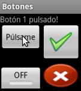

## ImageButton

Botón con una 'imagen' definida en la propiedad **android:src**.

~~~{.xml}
<ImageButton android:id="@+id/Boton2"
    android:layout_width="wrap_content"
    android:layout_height="wrap_content"
    android:src="@drawable/validate" />
~~~

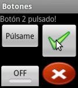

## ToggleButton

Tiene dos estados:

-  **pulsado** cuyo texto se asigna en la propiedad **android:textOn** y

-  **no pulsado** cuyo texto se asigna en la propiedad **android:textOn**.

~~~{.xml}
<ToggleButton android:id="@+id/Boton3"
    android:textOn="ON"
    android:textOff="OFF"
    android:layout_width="wrap_content"
    android:layout_height="wrap_content" />
~~~

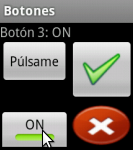

## Eventos

~~~{.java}
final ToggleButton boton3 = (ToggleButton) findViewById(R.id.Boton3);

boton3.setOnClickListener(new View.OnClickListener() {
    public void onClick(final View view) {
      if(boton3.isChecked()) {
        mensaje.setText("Botón 3: ON");
      } else {
        mensaje.setText("Botón 3: OFF");
      }
    }
  }
);
~~~

~~~{.java}
final ToggleButton boton3 = (ToggleButton) findViewById(R.id.Boton3);

boton3.setOnClickListener(new View.OnClickListener() {
    public void onClick(final View view) {
      final ToggleButton botonEvento = (ToggleButton) view;
      if(botonEvento.isChecked()) {
        mensaje.setText("Botón 3: ON");
      } else {
        mensaje.setText("Botón 3: OFF");
      }
    }
  }
);
~~~

## Otras propiedades:

color de fondo (android:background),

estilo de fuente (android:typeface),

color de fuente (android:textcolor),

tamaño de fuente (android:textSize),

etc.

## Ejemplo personalización

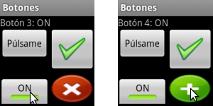

## Personalizar el aspecto

/res/drawable/toggle-style.xml

~~~{.xml}
<?xml version="1.0" encoding="UTF-8"?>
<selector xmlns:android="http://schemas.android.com/apk/res/android">
    <item android:state_checked="false" android:drawable="@drawable/ko" />
    <item android:state_checked="true" android:drawable="@drawable/ok" />
</selector>
~~~

/res/layout/main.xml

~~~{.xml}
<ToggleButton android:id="@+id/Boton4"
  android:layout_width="wrap_content"
  android:layout_height="wrap_content"
  android:textOn=""
  android:textOff=""
  android:background="@drawable/toggle-style" />
~~~

# Imágenes y textos

## Imágenes y textos en Android

## ImageView

Permite mostrar imágenes en la aplicación.

Propiedades:

-  **android:src** indica la imagen a mostrar,

-  **android:maxWidth** indica el ancho máximo,

-  **android:maxHeight** indica la altura máxima,

-  etc.

Se puede cambiar la imagen mediante código:

~~~{.java}

foto.setImageResource(R.drawable.otra_foto);
~~~

## Ejemplo ImageView

~~~{.xml}
<ImageView android:id="@+id/Foto"
    android:layout_width="wrap_content"
    android:layout_height="wrap_content"
    android:src="@drawable/foto" />
~~~

## TextView

Se utiliza para mostrar un texto al usuario, mediante propiedad **android:text**.

Otras propiedades:

-  **android:background** (color de fondo),

-  **android:textColor** (color del texto),

-  **android:textSize** (tamaño de la fuente),

-  **android:textStyle** (estilo del texto: normal, negrita, cursiva),

-  **android:typeface** (tipo de letra: normal, sans, serif, monospace),

-  etc.

También se puede cambiar el texto mediante código:

~~~{.java}
final TextView label = (TextView)findViewById(R.id.Label);
label.setText(texto);
~~~

## Ejemplo TextView

~~~{.xml}
<TextView android:id="@+id/Label"
  android:layout_width="fill_parent"
  android:layout_height="wrap_content"
  android:layout_below="@id/Icon"
  android:text="@string/write"
  android:textSize="20dp"
  android:textColor="#FFFFFF"
  android:textStyle="bold"
  android:background="#97C03D"
  android:typeface="monospace" />
~~~

## EditText

Permite la introducción y edición de texto por parte del usuario.

El texto a mostrar por defecto en la caja de texto se establece en la propiedad **android:text**.

También se puede cambiar el texto mediante código:

~~~{.java}
final EditText cuadroTexto = (EditText)findViewById(R.id.Label);
cuadroTexto.setText(texto);
~~~

## Ejemplo EditText

~~~{.xml}
<EditText android:id="@+id/TextBox"
  android:layout_width="fill_parent"
  android:layout_height="wrap_content"
  android:layout_below="@id/Label" />
~~~

## Spanned, Spannable y Editable

Un **Spanned** es una cadena de caracteres a la que podemos insertar otros objetos
  a modo de marcas o etiquetas (spans) asociados a rangos de caracteres.

La interfaz **Spannable**, hereda de Spanned, y permite la modificación de esas marcas.

La interfaz **Editable**, hereda de Spannable, y permite además la modificación del texto.

## Spans

Existen muchos tipos de **spans** predefinidos, entre otros:

-  TypefaceSpan. Modifica el tipo de letra (normal, sans, serif, monospace).

-  StyleSpan. Modifica el estilo del texto (normal, negrita, cursiva).

-  ForegroudColorSpan. Modifica el color del texto.

-  AbsoluteSizeSpan. Modifica el tamaño de fuente.

~~~{.java}
// Creamos un texto con parte en negrita
final Editable texto = Editable.Factory.getInstance().newEditable("Esto es un simulacro.");
texto.setSpan(new StyleSpan(Typeface.BOLD), 11, 20, Spanned.SPAN_EXCLUSIVE_EXCLUSIVE);
textBox.setText(texto);
~~~

## La clase Html

Muestra el texto con etiquetas de formato HTML:

~~~{.java}
final String html = Html.toHtml(textBox.getText());
~~~

Asignar texto con formato HTML (sólo funciona con las etiquetas básicas):

~~~{.java}
textBox.setText(Html.fromHtml("Otro <b>texto</b> de ejemplo."), BufferType.SPANNABLE);
~~~

# CheckBoxs y RadioButtons

## CheckBox

Se suele utilizar para marcar o desmarcar opciones en una aplicación.

~~~{.xml}
<CheckBox android:id="@+id/ChkMarcame"
    android:layout_width="wrap_content"
    android:layout_height="wrap_content"
    android:text="Márcame!" />
~~~

## Métodos CheckBox

Podremos hacer uso de los métodos:

-  **isChecked()** para conocer el estado del control, y

-  **setChecked(estado)** para establecer un estado concreto para el control.

~~~{.java}
if (checkBox.isChecked()) {
    checkBox.setChecked(false);
}
~~~

## Eventos CheckBox

~~~{.java}
final CheckBox cb = (CheckBox) findViewById(R.id.ChkMarcame);

cb.setOnCheckedChangeListener(new CheckBox.OnCheckedChangeListener() {
  public void onCheckedChanged(CompoundButton buttonView, boolean isChecked) {
    if (isChecked) {
        cb.setText("Checkbox marcado!");
    }
    else {
        cb.setText("Checkbox desmarcado!");
    }
  }
});
~~~

## RadioButton

Puede estar marcado o desmarcado.

Se utilizan dentro de un **RadioGroup** donde sólo una puede estar marcada.

~~~{.xml}
<RadioGroup android:id="@+id/gruporb" android:orientation="vertical"
  android:layout_width="fill_parent"  android:layout_height="fill_parent" >

  <RadioButton android:id="@+id/radio1" android:text="Opción 1"
    android:layout_width="wrap_content" android:layout_height="wrap_content" />

  <RadioButton android:id="@+id/radio2" android:text="Opción 2"
    android:layout_width="wrap_content" android:layout_height="wrap_content" />

</RadioGroup>
~~~

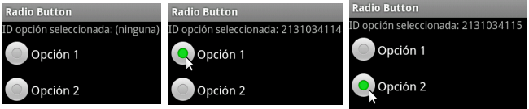

## Métodos RadioGroup

Los más importantes:

-  **check(id)** para marcar una opción determinada mediante su ID,

-  **clearCheck()** para desmarcar todas las opciones, y

-  **getCheckedRadioButtonId()** que devolverá el ID de la opción marcada (o el valor -1 si no hay ninguna marcada).

~~~{.java}
final RadioGroup rg = (RadioGroup) findViewById(R.id.gruporb);
rg.clearCheck();
rg.check(R.id.radio1);
int idSeleccionado = rg.getCheckedRadioButtonId();
~~~

## Eventos RadioGroup

~~~{.java}
final RadioGroup rg = (RadioGroup) findViewById(R.id.gruporb);

rg.setOnCheckedChangeListener(new RadioGroup.OnCheckedChangeListener() {
  public void onCheckedChanged(RadioGroup group, int checkedId) {
    lblMensaje.setText("ID opcion seleccionada: " + checkedId);
  }
});
~~~

# Listas

## Adapters

Necesarios para renderizar los items de las listas.

Aunque podemos creer los nuestros propios, existen adaptadores sencillos:

-  **ArrayAdapter**: El más sencillo. Utiliza array de objetos.

-  **SimpleAdapter**: Para mapear datos sobre los controles de un fichero XML de layout.

-  **SimpleCursorAdapter**: Para mapear las columnas de un cursor sobre elementos visuales.

## Spinner

Son listas desplegables.

## Código Spinner

~~~{.xml}
<Spinner
  android:id="@+id/CmbOpciones"
  android:layout_width="fill_parent"
  android:layout_height="wrap_content" />
~~~

~~~{.java}
final String[] datos = new String[]{"Elem1","Elem2","Elem3","Elem4","Elem5"};

final Spinner cmbOpciones = (Spinner) findViewById(R.id.CmbOpciones);

ArrayAdapter<String> adaptador = new ArrayAdapter<String>(
  context,
  android.R.layout.simple_spinner_item,
  datos);

// para indicar como mostrar la lista de elementos
adaptador.setDropDownViewResource(android.R.layout.simple_spinner_dropdown_item);

cmbOpciones.setAdapter(adaptador);
~~~

## Eventos Spinner

~~~{.java}
cmbOpciones.setOnItemSelectedListener(new OnItemSelectedListener() {
  public void onItemSelected(
    AdapterView<?> parent, View view, int position, long id) {
      lblMensaje.setText("Seleccionado: " + datos[position]);
  }

  public void onNothingSelected(AdapterView<?> parent) {
      lblMensaje.setText("");
  }
});
~~~

## ListView

Muestra una lista seleccionable:

## Código ListView

~~~{.xml}
<ListView
  android:id="@+id/LstOpciones"
  android:layout_width="wrap_content"
  android:layout_height="wrap_content" />
~~~

~~~{.java}
final String[] datos = new String[]{"Elem1","Elem2","Elem3","Elem4","Elem5"};

ArrayAdapter<String> adaptador = new ArrayAdapter<String>(
  context,
  android.R.layout.simple_list_item_1,
  datos);

ListView lstOpciones = (ListView)findViewById(R.id.LstOpciones);

lstOpciones.setAdapter(adaptador);
~~~

## Eventos ListView

~~~{.java}
lstOpciones.setOnItemClickListener(new OnItemClickListener() {
    public void onItemClick(
      AdapterView<?> parent, View view, int position, long id) {
        //Acciones necesarias al hacer click
    }
});
~~~

## Datos complejos

~~~{.java}
public class Titular {

    private String titulo;
    private String subtitulo;

    // constructor y getters
}
~~~

## Item Layout personalizado

/res/layout/listitem-titular.xml

~~~{.xml}
<?xml version="1.0" encoding="utf-8"?>

<LinearLayout xmlns:android="http://schemas.android.com/apk/res/android"
  android:layout_width="wrap_content"  android:layout_height="wrap_content"
  android:orientation="vertical">

  <TextView android:id="@+id/Titulo"
    android:layout_width="fill_parent" android:layout_height="wrap_content"
    android:textStyle="bold"           android:textSize="20dp" />

  <TextView android:id="@+id/Subtitulo"
    android:layout_width="fill_parent" android:layout_height="wrap_content"
    android:textStyle="normal"         android:textSize="12dp" />

</LinearLayout>
~~~

## Adaptador personalizado

~~~{.java}
public class TitularesAdapter extends ArrayAdapter<Titular> {

  public View getView(final int position, final View listItem, final ViewGroup parent) {

    // recojemos el titular para esa posición
    final Titular titular = this.getItem(position);

    // inflamos la vista desde el xml
    final Activity context = (Activity) this.getContext();
    listItem = context.getLayoutInflater().inflate(R.layout.listitem_titular, null);

    // cogemos los elementos de la vista
    final TextView titulo = (TextView) listItem.findViewById(R.id.Titulo);
    final TextView subtitulo = (TextView) listItem.findViewById(R.id.Subtitulo);

    // modificamos los textos de la vista (el titulo y el el subtitulo)
    titulo.setText(titular.getTitulo());
    subtitulo.setText(titular.getSubtitulo());

    return listItem;
  }
}
~~~

## Código ListView personalizado

~~~{.java}
Titular[] datos = new Titular[]{
  new Titular("Título 1", "Subtítulo largo 1"),
  new Titular("Título 2", "Subtítulo largo 2"),
  new Titular("Título 3", "Subtítulo largo 3"),
  new Titular("Título 4", "Subtítulo largo 4"),
  new Titular("Título 5", "Subtítulo largo 5")};

AdaptadorTitulares adaptador = new AdaptadorTitulares(this, datos);

ListView lstOpciones = (ListView)findViewById(R.id.LstOpciones);

lstOpciones.setAdapter(adaptador);
~~~

## GridView

Muestra opciones divididas en filas y columnas.

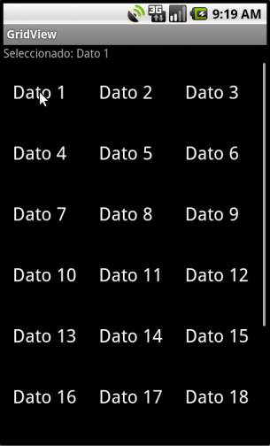

## Código GridView

~~~{.xml}
<GridView android:id="@+id/GridOpciones" android:stretchMode="columnWidth"
  android:layout_width="fill_parent"     android:layout_height="fill_parent"
  android:numColumns="auto_fit"          android:columnWidth="80dp"
  android:horizontalSpacing="5dp"        android:verticalSpacing="10dp" />
~~~

~~~{.java}
ArrayAdapter<String> adaptador = new ArrayAdapter<String>(
  context,
  android.R.layout.simple_list_item_1,
  datos);

final GridView grdOpciones = (GridView)findViewById(R.id.GridOpciones);

grdOpciones.setAdapter(adaptador);
~~~

## Eventos GridView

~~~{.java}
grdOpciones.setOnItemSelectedListener(new OnItemSelectedListener() {
  public void onItemSelected(
    AdapterView<?> parent, View view, int position, long id) {
      lblMensaje.setText("Seleccionado: " + datos[position]);
  }

  public void onNothingSelected(AdapterView<?> parent) {
      lblMensaje.setText("");
  }
});
~~~

# Menús

## Menú normal

## Código

Se puede hacer (como todas las vistas) por código o mediante XML:

~~~{.xml}
<menu xmlns:android="http://schemas.android.com/apk/res/android">
  <item android:id="@+id/Menu1" android:title="Menú 1" android:icon="@drawable/tag"></item>
  <item android:id="@+id/Menu2" android:title="Menú 2" android:icon="@drawable/filter"></item>
  <item android:id="@+id/Menu3" android:title="Menú 3" android:icon="@drawable/chart">
    <menu>
      <item android:id="@+id/Submenu31" android:title="Submenú 3.1" />
      <item android:id="@+id/Submenu32" android:title="Submenú 3.2" />
    </menu>
  </item>
</menu>
~~~

~~~{.java}
public boolean onCreateOptionsMenu(Menu menu) {
  final MenuInflater inflater = getMenuInflater();
  inflater.inflate(R.menu.menu_principal, menu);
  return true;
}
~~~

## Evento de menú

~~~{.java}
public boolean onOptionsItemSelected(final MenuItem item) {
  switch (item.getItemId()) {
    case R.id.Menu1:
      this.mensaje.setText("Menú 1 pulsado!");
      return true;
    case R.id.Menu2:
      this.mensaje.setText("Menú 2 pulsado!");
      return true;
    case R.id.Menu3:
      this.mensaje.setText("Menú 3 pulsado!");
      return true;
    case R.id.Submenu31:
      this.mensaje.setText("Submenú 3.1 pulsado!");
      return true;
    case R.id.Submenu32:
      this.mensaje.setText("Submenú 3.2 pulsado!");
      return true;
    default:
      return super.onOptionsItemSelected(item);
  }
}
~~~

## Menú contextual

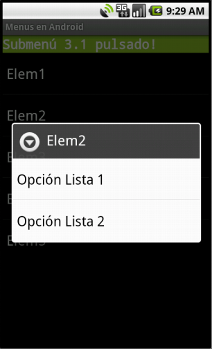

## Layout menú contextual

~~~{.xml}
<menu xmlns:android="http://schemas.android.com/apk/res/android">
  <item android:id="@+id/OpcionLista1" android:title="Opción Lista 1" />
  <item android:id="@+id/OpcionLista2" android:title="Opción Lista 2" />
</menu>
~~~

## Asociar menú contextual

~~~{.java}
public void onCreate(final Bundle savedInstanceState) {
  super.onCreate(savedInstanceState);
  this.setContentView(R.layout.main);

  // Obtenemos las referencias a los controles
  this.lista = (ListView) this.findViewById(R.id.Lista);

  ...

  // Asociamos los menús contextuales a los controles
  this.registerForContextMenu(this.lista);
}
~~~

## Crear menú contextual

~~~{.java}
public void onCreateContextMenu(ContextMenu menu, View view, ContextMenuInfo menuInfo) {
  super.onCreateContextMenu(menu, view, menuInfo);

  final AdapterContextMenuInfo info = (AdapterContextMenuInfo) menuInfo;

  menu.setHeaderTitle(this.lista.getAdapter().getItem(info.position).toString());

  final MenuInflater inflater = this.getMenuInflater();

  inflater.inflate(R.menu.menu_contextual_lista, menu);
}
~~~

## Evento menú contextual

~~~{.java}
public boolean onContextItemSelected(final MenuItem item) {

  final AdapterContextMenuInfo info = (AdapterContextMenuInfo) item.getMenuInfo();

  switch (item.getItemId()) {
    case R.id.OpcionLista1:
      this.mensaje.setText("Lista[" + info.position + "]: Opcion 1 pulsada!");
      return true;
    case R.id.OpcionLista2:
      this.mensaje.setText("Lista[" + info.position + "]: Opcion 2 pulsada!");
      return true;
    default:
      return super.onContextItemSelected(item);
  }
}
~~~

# Diálogos

## AlertDialog

Muestra un mensaje pidiendo confirmación al usuario para continuar.

~~~{.java}
final AlertDialog.Builder alert = new AlertDialog.Builder(context);
alert.setTitle("Alerta!");
alert.setMessage("Este es el texto de la alerta");
alert.setIcon(R.drawable.icon);
alert.setPositiveButton(android.R.string.ok, null);
alert.show();
~~~

## Toast

Mensaje que se muestra en pantalla durante unos segundos al usuario.

No deberían utilizarse para hacer notificaciones demasiado importantes.

La clase Toast dispone de los siguientes métodos:

-  **makeText(contexto, texto, duracion)** con duración LENGTH_LONG o LENGTH_SHORT

-  **show()** para mostrarlo

-  **setGravity()** con los valores CENTER, LEFT, RIGHT, TOP, BOTTOM

-  **setDuration(duracion)** con duración LENGTH_LONG o LENGTH_SHORT

-  **setView(layout)** para personalizarlo con un layout.

## Toast por defecto

~~~{.java}
Toast toast = Toast.makeText(
  getApplicationContext(), "Toast por defecto", Toast.LENGTH_SHORT);
toast.show();
~~~

## Toast con gravity

~~~{.java}
Toast toast = Toast.makeText(
  getApplicationContext(), "Toast por defecto", Toast.LENGTH_SHORT);
toast.setGravity(Gravity.LEFT,0,0);
toast.show();
~~~

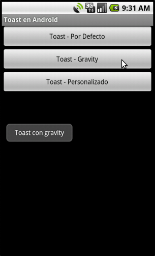

## Toast personalizado

~~~{.xml}
<?xml version="1.0" encoding="utf-8"?>
<LinearLayout xmlns:android="http://schemas.android.com/apk/res/android"
  android:id="@+id/lytLayout"            android:orientation="horizontal"
  android:layout_width="fill_parent"     android:layout_height="fill_parent"
  android:background="#555555"           android:padding="5dp" >

  <ImageView android:id="@+id/imgIcono"  android:src="@drawable/marcador"
    android:layout_height="wrap_content" android:layout_width="wrap_content" />

  <TextView android:id="@+id/txtMensaje" android:layout_gravity="center_vertical"
    android:layout_width="wrap_content"  android:layout_height="wrap_content"
    android:textColor="#FFFFFF"          android:paddingLeft="10dp" />

</LinearLayout>
~~~

~~~{.java}
// inflamos el layout
LayoutInflater inflater = getLayoutInflater();
View layout = inflater.inflate(

// cogemos el campo de texto del layout inflado y ponemos el texto
TextView txtMsg = (TextView) layout.findViewById(R.id.txtMensaje);
txtMsg.setText("Toast Personalizado");

// nos creamos el toast, lo configuramos y lo mostramos
Toast toast = new Toast(getApplicationContext());
toast.setDuration(Toast.LENGTH_SHORT);
toast.setView(layout);
toast.show();
~~~

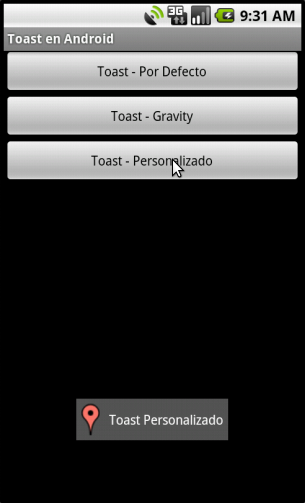

## Notificación en la barra de estado

Aparece un icono en la **barra de estado**.

Pinchando y arrastrando la barra de estado hacia abajo podemos ver
  los textos de las notificaciones.

Suele usarse con servicios.

## Notificación simple

~~~{.java}
final Notification notification = new Notification(
  R.drawable.icon, "Texto barra de estado", System.currentTimeMillis());

final Intent notificationIntent = new Intent(this, MyClass.class);
final PendingIntent contentIntent = PendingIntent.getActivity(this, 0, notificationIntent, 0);

notification.setLatestEventInfo(context, "Título", "Texto del mensaje",  contentIntent);

final NotificationManager notificationManager =
  (NotificationManager) context.getSystemService(Context.NOTIFICATION_SERVICE);

~~~

## Pantalla notificación simple

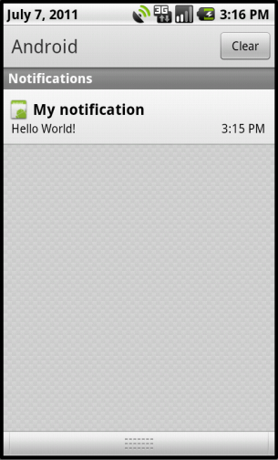

## Notificación personalizada

~~~{.java}
final Notification notification = new Notification(
  R.drawable.icon, "Texto barra de estado", System.currentTimeMillis());

final RemoteViews contentView = new RemoteViews(this.getPackageName(), R.layout.layout);
contentView.setImageViewResource(R.id.image, R.drawable.icon);
contentView.setTextViewText(R.id.text, "Texto del mensaje");
notification.contentView = contentView;

final Intent notificationIntent = new Intent(this, MyClass.class);
final PendingIntent contentIntent = PendingIntent.getActivity(this, 0, notificationIntent, 0);

final NotificationManager notificationManager =
  (NotificationManager) context.getSystemService(Context.NOTIFICATION_SERVICE);

~~~

## Pantalla notificación personalizada

# Ficheros

## Entrada/Salida en Java

Todas las clases relacionadas con la Entrada/Salida estén en el paquete **java.io**

Java lo que maneja en realidad son flujos, ya sean de **flujos de bytes o de caracteres**.

Los **flujos de entrada** son de entrada de datos del exterior hacia el sistema.

Los **flujos de salida** son de salida de datos del sistema hacia el exterior.

Esto se hizo así, de forma genérica, para poder **manejar igual** todos los flujos:
el de entrada/salida estándar (teclado y monitor), el de los ficheros o el de red, etc.

Las clases del paquete java.io implementan el **patrón Decorator**.

## Flujos de bytes en Java

**InputStream/OutputStream**

-  **Clases abstractas** que definen las funciones básicas de lectura y escritura
    de un **flujo de bytes sin estructurar**.

**FileInputStream/FileOutputStream**

-  Pensadas para trabajar con **archivos binarios**.

**BufferedInputStream/BufferedOutputStream**

-  **Decoradores** que añaden un **buffer** a los flujos de bytes.

## Flujos de caracteres en Java

**Reader/Writer**

-  **Clases abstractas** que definen las funciones básicas de lectura y escritura
    de un **flujo de caracteres**.

**InputStreamReader/OutputStreamWriter**

-  **Convierten flujos** de bytes en flujos de caracteres.

**FileReader/FileWriter**

-  Pensadas para trabajar con **archivos de texto**.

**BufferedReader/BufferedWriter**

-  **Decoradores** que añaden un **buffer** a los flujos de caracteres.

**PrintWriter**

-  Posee los métodos **print y println** que otorgan gran potencia a la escritura.

## La clase File de Java

**No** proporciona métodos de **lectura/escritura** a los archivos.

**Sólo** proporciona operaciones a nivel de **sistema de archivos**:

-  gestión de permisos,

-  listado de archivos,

-  crear carpetas,

-  borrar ficheros,

-  cambiar nombre,

-  etc.

## Ficheros en Android

Podremos almacenar ficheros en:

-  La memoria interna del dispositivo.

-  La tarjeta SD externa, si disponible.

-  La propia aplicación, en forma de recurso.

Existen distintos modos de apertura:

-  **MODE_PRIVATE** para acceso privado desde nuestra aplicación,

-  **MODE_APPEND** para añadir datos a un fichero ya existente,

-  **MODE_WORLD_READABLE** para permitir a otras aplicaciones leer el fichero y

-  **MODE_WORLD_WRITABLE** para permitir a otras aplicaciones escribir sobre el fichero.

Se utiliza los métodos:

-  **openFileOutput()** que devuelve un **FileOutputStream**

-  **openFileInput()** que devuelve un **FileInputStream**

-  **getResources().openRawResource(idFichero)** que devuelve un **InputStream**

## Escribir fichero memoria interna

~~~{.java}
OutputStreamWriter fichero = null
try {

  // abrimos el fichero
  fichero = new OutputStreamWriter(
    openFileOutput("prueba_int.txt", Context.MODE_PRIVATE));

  // escribimos en el fichero
  fichero.write("Texto de prueba.");

} catch (final Exception e) {
  Log.e("Ficheros", "Error al escribir fichero en memoria interna", e);
} finally {
  try {
    if (fichero != null) fichero.close();
  } catch (final Exception e) {
    Log.e("Ficheros", "Error cerrando el fichero en memoria interna");
  }
}
~~~

## Directorio memoria interna

Android almacena por defecto los ficheros creados en una ruta determinada:

~~~{.bash}
/data/data/paquete.java.de.la.aplicacion/files/nombre_fichero
~~~

En nuestro caso:

~~~{.bash}
/data/data/curso.android/files/prueba_int.txt
~~~

## Memoria interna en el DDMS

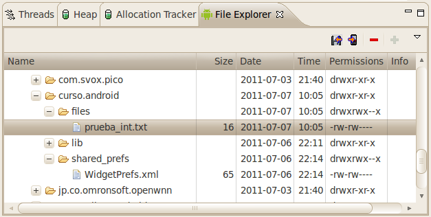

## Leer fichero memoria interna

~~~{.java}
BufferedReader fichero = null;
try {

  // abrimos el fichero para lectura
  fichero = new BufferedReader(new InputStreamReader(
    openFileInput("prueba_int.txt")));

  // leemos el fichero linea a linea
  final StringBuilder texto = new StringBuilder();
  String linea = fichero.readLine();
  while (linea != null) {
    texto.append(linea);
    linea = fichero.readLine();
  }
} catch (final Exception e) {
  Log.e("Ficheros", "Error al leer fichero desde memoria interna", e);
} finally {
  try {
    if (fichero != null) fichero.close();
  } catch (final Exception e) {
    Log.e("Ficheros", "Error cerrando el fichero desde memoria interna");
  }
}
~~~

## Leer fichero desde recurso

~~~{.java}
BufferedReader fichero = null;
try {

  // abrimos el fichero para lectura
  fichero = new BufferedReader(new InputStreamReader(
    FicherosActivity.this.getResources().openRawResource(R.raw.prueba_raw)));

  // leemos el fichero linea a linea
  final StringBuilder texto = new StringBuilder();
  String linea = fichero.readLine();
  while (linea != null) {
    texto.append(linea);
    linea = fichero.readLine();
  }
} catch (final Exception e) {
  Log.e("Ficheros", "Error al leer fichero desde recurso raw", e);
} finally {
  try {
    if (fichero != null) fichero.close();
  } catch (final Exception e) {
    Log.e("Ficheros", "Error cerrando el fichero desde recurso raw");
  }
}
~~~

## Leer/escribir en tarjeta SD

Tenemos que comprobar el estado con la función **Environment.getExternalStorageState()**:

-  Si es igual a Environment.**MEDIA_MOUNTED**
    - Podremos leer y escribir.

-  Si es igual a Environment.**MEDIA_MOUNTED_READ_ONLY**
    - Sólo podremos leer.

-  Ver otros estado en [Environment](http://developer.android.com/reference/android/os/Environment.html)

Además habrá que dar permisos en el **AndroidManifest.xml**:

~~~{.xml}
<uses-permission android:name="android.permission.WRITE_EXTERNAL_STORAGE" />
~~~

## Escribir en tarjeta SD

~~~{.java}
// Si la memoria externa está disponible y se puede escribir
if (Environment.MEDIA_MOUNTED.equals(Environment.getExternalStorageState())) {

  OutputStreamWriter fichero = null;
  try {

    // abrimos el fichero para escritura
    fichero = new OutputStreamWriter(new FileOutputStream(
      new File(Environment.getExternalStorageDirectory().getAbsolutePath(), "prueba_sd.txt")));

    // escribimos en el fichero
    fichero.write("Texto de prueba para el fichero guardado en la SD.");

  } catch (final Exception e) {
    Log.e("Ficheros", "Error al escribir fichero a tarjeta SD", e);
  } finally {
    try {
      if (fichero != null) fichero.close();
    } catch (final Exception e) {
      Log.e("Ficheros", "Error cerrando el fichero a tarjeta SD");
    }
  }
}
~~~

## Leer en tarjeta SD

~~~{.java}
// Si la memoria externa está disponible y se puede leer
if (Environment.MEDIA_MOUNTED.equals(Environment.getExternalStorageState())
    || Environment.MEDIA_MOUNTED_READ_ONLY.equals(Environment.getExternalStorageState()) {

  BufferedReader fichero = null;
  try {

    // abrimos el fichero para lectura
    fichero = new BufferedReader(new InputStreamReader(new FileInputStream(
      new File(Environment.getExternalStorageDirectory().getAbsolutePath(), "prueba_sd.txt"))));

    // leemos el fichero linea a linea
    final StringBuilder texto = new StringBuilder();
    String linea = fichero.readLine();
    while (linea != null) {
      texto.append(linea);
      linea = fichero.readLine();
    }
  } catch (final Exception e) {
    Log.e("Ficheros", "Error al leer fichero desde memoria SD", e);
  } finally {
    try {
      if (fichero != null) fichero.close();
    } catch (final Exception e) {
      Log.e("Ficheros", "Error cerrando el fichero desde memoria SD");
    }
  }
}
~~~

## Tarjeta SD en el DDMS

# Preferencias

## Preferencias en Android

Son datos que una aplicación guarda para personalizar la experiencia del usuario.

Cada preferencia se almacenará en forma de **clave-valor**.

Se guardan en fichero XML.

La clase **SharedPrefences** gestiona colecciones de preferencias,
  que se diferenciarán mediante un identificador único.

Para obtener una colección utilizaremos el método **getSharedPrefences()**
  al que pasaremos el identificador de la colección y un modo de acceso:

-  **MODE_PRIVATE**: Sólo nuestra aplicación tiene acceso.

-  **MODE_WORLD_READABLE**: Todas las aplicaciones pueden leer.

-  **MODE_WORLD_WRITABLE**: Todas las aplicaciones pueden leer y modificar.

## Recuperar Preferencias

~~~{.java}
SharedPreferences preferencias = getSharedPreferences("MIS_PREFERENCIAS",Context.MODE_PRIVATE);

String correo = preferencias.getString("email", "por_defecto@email.com");
~~~

## Guardar Preferencias

~~~{.java}
SharedPreferences preferencias = getSharedPreferences("MIS_PREFERENCIAS",Context.MODE_PRIVATE);

SharedPreferences.Editor editor = preferencias.edit();
editor.putString("email", "modificado@email.com");
editor.commit();
~~~

## Directorio Preferencias

Android almacena las preferencias en ficheros XML en una ruta determinada:

~~~{.bash}
/data/data/paquete.java.de.la.aplicacion/shared_prefs/nombre_coleccion.xml
~~~

En nuestro caso:

~~~{.bash}
/data/data/curso.android/shared_prefs/MIS_PREFERENCIAS.xml
~~~

El XML:

~~~{.xml}
<?xml version='1.0' encoding='utf-8' standalone='yes' ?>
<map>
    <string name="email">modificado@email.com</string>
</map>
~~~

## Preferencias en el DDMS

# XML

## Parsers XML

Los más conocidos son:

-  SAX (Simple API for XML):
    - Lee el fichero XML secuencialmente y va generando eventos que hay que capturar.
    - [http://developer.android.com/reference/javax/xml/parsers/SAXParser.html](http://developer.android.com/reference/javax/xml/parsers/SAXParser.html)

-  Android SAX:
    - Idem que el SAX paro los listener se asocian a etiquetas.
    - [http://developer.android.com/reference/android/sax/package-summary.html](http://developer.android.com/reference/android/sax/package-summary.html)

-  XmlPull:
    - Parecido a SAX sólo que es el programador el que va eligiendo hacia donde se lee el fichero.
    - [http://developer.android.com/reference/org/xmlpull/v1/XmlPullParser.html](http://developer.android.com/reference/org/xmlpull/v1/XmlPullParser.html)

-  DOM (Document Object Model):
    - Lee el fichero XML completamente y devuelve un árbol de elementos.
    - [http://developer.android.com/reference/javax/xml/parsers/DocumentBuilder.html](http://developer.android.com/reference/javax/xml/parsers/DocumentBuilder.html)

No los vamos a estudiar detenidamente, sólo a utilizarlos.

## RSS de europapress

Nosotros vamos a utilizar la RSS de [http://www.europapress.es/rss/rss.aspx](http://www.europapress.es/rss/rss.aspx):

~~~{.xml}
<rss version="2.0">
  <channel>
    ...
    <item>
      <title>Título de la noticia 1</title>
      <link>http://link_de_la_noticia_1.es</link>
      <description>Descripción de la noticia 1</description>
      ...
    </item>
    <item>
      <title>Título de la noticia 2</title>
      ...
    </item>
    ...
  </channel>
</rss>
~~~

## Código

~~~{.java}
public class Noticia {

  private String titulo;
  private String link;
  private String descripcion;

  // getters y setters
}
~~~

~~~{.java}
// donde Xxx será el parser que codifiquemos (SAX, StAX, XmlPull o DOM)
RssParserXxx parserXxx = new RssParserXxx("http://www.europapress.es/rss/rss.aspx");

// parseamos el XML del RSS
List<Noticia> noticias = parserXxx.parse();

// Manipulación del array de noticias (ListView)
~~~

~~~{.xml}
<uses-permission android:name="android.permission.INTERNET" />
~~~

## Ejemplo XML

# JSON

## APIS REST

Hoy en día, cada vez hay más APIS REST públicas:
	- [http://dev.twitter.com/](http://dev.twitter.com/)
	- [http://developers.facebook.com/](http://developers.facebook.com/)

REST utiliza los métodos definidos en el protocolo HTTP:
	- **GET**: para recuperar un recurso.
	- **POST**: para insertar un recurso.
	- **PUT**: para actualizar un recurso.
	- **DELETE**: para borrar un recurso.

## JSON VS XML

En las APIS REST **el intercambio de información se hace sobre todo con JSON**
  porque es más sencillo y más rápido de procesar que el XML.

~~~{.json}
{
	"menu": {
		"id": "file",
		"value": "File",
		"menuitems": [ "Open", "Close" ]
	}
}
~~~

~~~{.xml}
<menu id="file" value="File">
  <menuitems>
    <item>Open<item>
    <item>Close<item>
  </menuitems>
</menu>
~~~
  
## Recuperar JSON

~~~{.java}
final HttpResponse response = new DefaultHttpClient().execute(new HttpGet(
	"http://twitter.com/statuses/user_timeline/" + twitterUserName	+ ".json"));

final int statusCode = response.getStatusLine().getStatusCode();

if (statusCode == 200) {

	final BufferedReader reader = new BufferedReader(new InputStreamReader(
		response.getEntity().getContent()));
	
	final StringBuilder json = new StringBuilder();
	String line;
	while ((line = reader.readLine()) != null) {
		json.append(line);
	}
	
	JSONArray jsonArray = new JSONArray(json.toString());

	final List<String> userTweets = new ArrayList<String>();
	for (int i = 0; i < jsonArray.length(); i++) {
		userTweets.add(jsonArray.getJSONObject(i).getString("text"));
	}
}
~~~

# SQLite

## ¿Qué es SQLite?

Es un motor de **bases de datos**:

-  de código libre,

-  de tamaño pequeño,

-  transaccional y

-  que precisa poca configuración.

## Crear o actualizar

Se hace mediante una clase que **herede SQLiteOpenHelper** y sobreescriba 2 métodos:

-  **onCreate()** que se utiliza para crear la base de datos y

-  **onUpgrade()** que se ejecuta si la base de datos está creada y
      tienen una versión (pasada en el costructor) anterior.

## Ejecutar sentencias SQL

Luego se puede llamar a los método **getReadableDatabase()** o **getWritableDatabase()**
  que devuelven un objeto de tipo **SQLiteDatabase** con los métodos siguientes:

-  **rawQuery()** para ejecutar sentencias SQL de consulta (SELECT),

-  **close()** para cerrar la conexión a la base de datos.

Veremos que hay más métodos de ayuda:

-  **insert()**

-  **update()**

-  **delete()**

-  **query()**

## Directorio

Android almacena el fichero de la base de datos en una ruta determinada:

~~~{.bash}
/data/data/paquete.java.de.la.aplicacion/databases/nombre_base_datos
~~~

En el caso de nuestro ejemplo, la base de datos se almacenaría por tanto en la ruta siguiente:

~~~{.bash}
/data/data/curso.android/databases/data
~~~

## SQLite en el DDMS

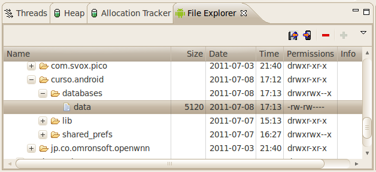

## Consola SQLite

~~~{.bash}
alumno@alumno-laptop:~$ cd android-sdk-linux_x86/platform-tools/
alumno@alumno-laptop:~/android-sdk-linux_x86/platform-tools$ adb -s emulator-5554 shell
## sqlite3 /data/data/curso.android/databases/data
SQLite version 3.5.9
Enter ".help" for instructions
sqlite> select * from notes;
1|Primera nota  |Texto primera nota
2|Segunda nota  |Texto segunda nota
sqlite> .exit
## exit
alumno@alumno-laptop:~/android-sdk-linux_x86/platform-tools$
~~~

## Insert (normal y helper)

~~~{.java}
db.execSQL("INSERT INTO notes (title, body) VALUES ('Primera nota', 'Texto primera nota')");
~~~

~~~{.java}
// Indicamos el nombre de la tabla
final String nombreTabla = "notes"

// Creamos el registro a insertar como objeto ContentValues
final ContentValues valores = new ContentValues();
valores.put("tittle", "Primera nota");
valores.put("body", "Texto primera nota");

// Insertamos el registro en la base de datos
db.insert(nombreTabla, null, valores);
~~~

## Update (helper con where)

~~~{.java}
// Indicamos el nombre de la tabla
final String nombreTabla = "notes"

// Creamos el registro a actualizar como objeto ContentValues
final ContentValues valores = new ContentValues();
valores.put("body", "Texto primera nota);

// Indicamos una clausula where
final String where = "tittle='Primera nota'"

// Actualizamos el registro en la base de datos
db.update(nombreTabla, valores, where);
~~~

## Delete (helper con parámetros)

~~~{.java}
// Indicamos el nombre de la tabla
final String nombreTabla = "notes"

// Indicamos una clausula where, esta vez con un parametro
final String where = "tittle=?";

final String[] parametros = new String[]{"Primera nota"};

// Borramos el registro en la base de datos
db.delete(nombreTabla, where, parametros);
~~~

## Consultas

~~~{.java}
final Cursor c = db.rawQuery("SELECT tittle, body FROM notes WHERE title='Primera nota'");
~~~

~~~{.java}
final String[] argumentos = new String[] {"Primera nota"};
final Cursor c = db.rawQuery("SELECT tittle, body FROM notes WHERE title=?", argumentos);
~~~

~~~{.java}
final String nombreTabla = "notes"
final String[] campos = new String[] {"tittle", "body"};
final String where = "tittle=?";
final String[] argumentos = new String[] {"usu1"};
final String goupBy = null;
final String having = null;
final String orderBy = null;

final Cursor c = db.query(nombreTabla, campos, where, argumentos, goupBy, having, orderBy);
~~~

## Recorrer el cursor

Métodos:

-  **moveToFirst()**: mueve el puntero del cursor al primer registro devuelto
      y devuelve TRUE si no hay errores.

-  **moveToNext()**: mueve el puntero del cursor al siguiente registro devuelto
      y devuelve TRUE si no hay errores.

-  **getXXX(indiceColumna)** donde XXX = String, Double, etc. NOTA: los índices
      comienzan en 0.

-  **getCount()**: indica el número total de registros devueltos en el cursor.

-  **getColumnName(i)**: devuelve el nombre de la columna con índice i.

~~~{.java}
// Nos aseguramos de que existe al menos un registro
if (c.moveToFirst()) {

  // Recorremos el cursor hasta que no haya más registros
  do {
    final String tittle = c.getString(0);
    final String body = c.getString(1);
  } while(c.moveToNext());
}
~~~

# Logging

## Logging en Android

Android nos proporciona también su propio servicio de logging a través de la clase **android.util.Log**.

Todos los mensajes de log llevarán asociada la siguiente información:

-  **Fecha/Hora**: Indica cuando se generó el mensaje.

-  **Criticidad**: Nivel de gravedad del mensaje.

-  **PID**:        Código interno del proceso que ha introducido el mensaje.

-  **Tag**:        Etiqueta identificativa del mensaje.

-  **Mensaje**:    El texto completo del mensaje.

## Criticidad

- ------------- ---------------------------------
      Criticidad              Método

- ------------- ---------------------------------
        Error        e(tag, mensaje [, excepcion])

       Warning       w(tag, mensaje [, excepcion])

        Info         i(tag, mensaje [, excepcion])

        Debug        d(tag, mensaje [, excepcion])

       Verbose       v(tag, mensaje [, excepcion])

- ------------- ---------------------------------

## Ejemplo

~~~{.java}
public class LogsAndroid extends Activity {

    private static final String LOGTAG = "LogsAndroid";

    @Override
    public void onCreate(Bundle savedInstanceState) {
        super.onCreate(savedInstanceState);
        setContentView(R.layout.main);

        Log.e(LOGTAG, "Mensaje de error");
        Log.w(LOGTAG, "Mensaje de warning");
        Log.i(LOGTAG, "Mensaje de información");
        Log.d(LOGTAG, "Mensaje de depuración");
        Log.v(LOGTAG, "Mensaje de verbose");
    }
}
~~~

## LogCat

## Filtrado del LogCat

## Excepciones

~~~{.java}
try
{
    int a = 1/0;
}
catch(final Exception e)
{
    Log.e(LOGTAG, "División por cero!", e);
}
~~~

# App Widgets

## ¿Qué son los App Widgets?

Son elementos visuales que se colocan en la pantalla principal del dispositivo
  y muestra información que puede ser actualizada periódicamente.

Sólo es posible utilizar en su interfaz los siguientes:

-  **Contenedores**: FrameLayout, LinearLayout y RelativeLayout

-  **Controles**: Button, ImageButton, ImageView, TextView, ProgressBar, Chronometer y AnalogClock.

## Propiedades

Se definen en un fichero XML (mi_widget_provider.xml)

~~~{.xml}
<?xml version="1.0" encoding="utf-8"?>
<appwidget-provider xmlns:android="http://schemas.android.com/apk/res/android"
    android:initialLayout="@layout/mi_widget"
    android:minWidth="146dp"
    android:minHeight="146dp"
    android:label="Mi Widget"
    android:updatePeriodMillis="3600000"
    android:configure="curso.android.WidgetConfigurationActivity" />
~~~

Del ejemplo anterior:

-  **initialLayout**: referencia al layout XML que define la interfaz del Widget.

-  **minWidth** y **minHeight**: ancho y alto mínimo, en dp (density-independent pixels).
    - valor = (num-celdas * 74) – 2

-  **label**: nombre del widget en el menú de selección de Android.

-  **updatePeriodMillis**: frecuencia de actualización del widget, en milisegundos
    - si automático, mínimo cada 30 minutos, pero se puede disminuir con Alarmas.

-  **configure**: clase de configuración, que se lanza la primera vez.

## La clase AppWidgetProvider

Derivada de BroadcastReceiver, podemos sobreescribir:

-  **onEnabled()**: lanzado cuando se añade al escritorio la primera instancia de un widget.

-  **onUpdate()**: lanzado periodicamente cada vez que se debe actualizar un widget.

-  **onDeleted()**: lanzado cuando se elimina del escritorio una instancia de un widget.

-  **onDisabled()**: lanzado cuando se elimina del escritorio la última instancia de un widget.

-  **onReceive()**: lanzado cuando le llega un Intent.

## AndroidManifest.xml

~~~{.xml}
<activity android:name=".WidgetConfigurationActivity">
  <intent-filter>
    <action android:name="android.apwidget.action.APPWIDGET_CONFIGURE" />
  </intent-filter>
</activity>

<receiver android:name="curso.android.MiWidget" android:label="Mi Widget">
  <intent-filter>
    <action android:name="android.appwidget.action.APPWIDGET_UPDATE" />
  </intent-filter>
  <intent-filter>
    <action android:name="curso.android.ACTUALIZAR_WIDGET"/>
  </intent-filter>
  <meta-data
    android:name="android.appwidget.provider"
    android:resource="@xml/mi_widget_provider" />
</receiver>
~~~

Hacemos referencia a la **Activity de configuración**, diciendóle que responda
  al Intent **APPWIDGET_CONFIGURE**

El Widget está dentro de un elemento \<receiver>.

Normalmente responderá al Intent **APPWIDGET_UPDATE**, pero podemos definir
  nuestros propios Intent.

En el elemento \<meta-data> hacemos referencia a su XML de configuración.

# Content Resolvers

## ¿Para qué sirven los Content Resolvers?

Sirven para recoger datos de los **Content Providers**.

Ejemplo: Acceder a tu lista de contatos.

## Query

A un Content Resolver hay que pasarle una **query**:

~~~{.java}
final URI uri = Contacts.CONTENT_URI; // específica para cada ContentProvider
final String[] columns = null // columnas a retornar, null si todas
final String where = Contacts.HAS_PHONE_NUMBER + "=1";
final String[] parametros = null // parametros del where, null si no hay
final String columnSort = null // columna por la cual ordenar, null si da igual

final ContentResolver contentResolver = this.getContentResolver();
final Cursor cursor = contentResolver.query(uri, columns, where, parametros, columnSort);
~~~

El **cursor** que devuelve es el mismo explicado con **sqlite**

# Localización

## Localización en Android

Mecanismo fácil de programar, pero **poco intuitivo**:

-  Distintos provedores (GPS, antenas móviles, 3G, Wi-Fi)

-  Distintas propiedades (precisión, altura, velocidad, consumo, dirección)

-  No siempre disponibles, activos y permitidos.

-  No son síncronos.

## Lista de provedores disponibles

~~~{.java}
final LocationManager locationManager = (LocationManager) this.getSystemService(LOCATION_SERVICE);
final List<String> locationProviders = locationManager.getAllProviders();
~~~

Retorna el nombre de todos los provedores de localización disponibles
  en el dispositivo, estén activos o no y tenga o no permisos la aplicación
  para utilizarlos (permisos del AndroidManifest.xml)

## Recuperar un provedor

~~~{.java}
final LocationManager locationManager = (LocationManager) this.getSystemService(LOCATION_SERVICE);
final LocationProvider locationProvider = locationManager.getLocationProvider(providerName);
~~~

## Propiedades de un provedor

La clase **LocationProvider** nos facilita, entre otros, los siguientes métodos:

-  **getAccuracy()**: Tipo de precisión del provedor.
    - Criteria.ACCURACY_COARSE: precisión aproximada.
    - Criteria.ACCURACY_FINE: preción alta.

-  **getName()**: Nombre del provedor.

-  **getPowerRequirement()**: Consumo energético del provedor.
    - Criteria.POWER_LOW: bajo consumo energético.
    - Criteria.POWER_MEDIUM: consumo energético medio.

-  **requiresCell()**: Indica se requiere conexión telefónica (antenas móviles)

-  **requiresNetwork()**: Indica se requiere conexión a Internet.

-  **requiresSatellite()**: Indica se requiere conexión GPS.

-  **supportsAltitude()**: Indica si es capaz de mostar la altitud.

-  **supportsBearing()**: Indica si es capaz de mostar la dirección.

-  **supportsSpeed()**: Indica si es capaz de mostar la velocidad.

## Mejor provedor para para mi aplicación

~~~{.java}
final Criteria criteria = new Criteria();

// Indicamos los requisitos de nuestra apliación
criteria.setAccuracy(Criteria.ACCURACY_COARSE);
criteria.setAltitudeRequired(false);
criteria.setBearingRequired(true);
criteria.setPowerRequirement(Criteria.POWER_LOW);
criteria.setSpeedRequired(false);

// Indicamos si queremos que además el provedor esté activo
final boolean enabledOnly = false;

// Mejor proveedor para los requisitos indicados
final String bestLocationProvider = locationManager.getBestProvider(criteria, enabledOnly);

// Lista de proveedores que cumplen los requisitos indicados
final List<String> criteriaLocationProviders = locationManager.getProviders(criteria, enabledOnly);
~~~

## ¿Está activo el provedor?

~~~{.java}
final String providerName = LocationManager.GPS_PROVIDER;

if ( ! locationManager.isProviderEnabled(providerName) ) {

    mostrarAdvertenciaProviderDesactivado(providerName);
}
~~~

## Última localización conocida

Última localización conocida (hace una hora, un día, un mes o un año) para un provider concreto:

~~~{.java}
final Location location = locationManager.getLastKnownLocation(providerName);
~~~

## Subscribirse al provedor

~~~{.java}
locationManager.requestLocationUpdates(
  providerName, // nombre del provedor de localización
  timeInMillis, // tiempo mínimo, en milisegundos, entre actualizaciones
  distanceInMeters, // distancia mínima, en metros, entre actualizaciones
  new LocalitationListener(){

    public void onLocationChanged(final Location location) {
      mostrarPosicion(location); }

    public void onProviderDisabled(final String providerName){
      mostrarAdvertenciaProviderDesactivado(providerName); }

    public void onProviderEnabled(final String providerName){
      mostrarAdvertenciaProviderActivado(providerName); }

    public void onStatusChanged(final String provider, final int status, final Bundle extras){
      // status puede tomar los valores OUT_OF_SERVICE, TEMPORARILY_UNAVAILABLE, AVAILABLE
      mostrarAdvertenciaProviderActivado(providerName, status);
    }
  });
~~~

## Borrar la subscripción al provedor

~~~{.java}
locationManager.removeUpdates(providerName);
~~~

## Mostrar la localización

La clase **Location** nos facilita, entre otros, los siguientes métodos:

-  **distanceTo(final Location dest)**: devuelve la distancia en metros
      entre el punto que indica la propia Location y la pasada por parámetro.

-  **getAccuracy()**: devuelve la precisión en metros.

-  **getAltitude()**: devuelve la altitud en metros.

-  **getBearing()**: devuelve la dirección en grados Este desde el Norte verdadero.

-  **getLatitude()**: devuelve la latitud.

-  **getLongitude()**: devuelve la longitud.

-  **getProvider()**: nombre del provedor de localización.

-  **getSpeed()**: velocidad medida en metros por segundo.

## Localización en el emulador

Se puede cambiar los datos de localización del emulador desde el **DDMS** en la vista
  **Emulator Control** dentro de **Location Controls**.

Se puede cambiar, en sus pestañas correspondientes:

-  de forma **Manual**, modificando la longitud y la latitud en cajas de texto,

-  de forma automática, cargando archivos de datos geográficos
    - **GMX**
    - **KML**.

# Mapas

## Requisitos previos

Instalar **Google APIs** .

Crear un AVD que utilice este paquete como target.

Crear proyecto que que utilice este paquete como target.

## API Key

Para poder utilizar la API de Google Maps se requiere una **API Key**.

Estará asociada al certificado con el que firmamos nuestra aplicación.

Si cambiamos el certificado (publicación en el Market) habrá que cambiarla.

Para instalar aplicaciones en el emulador, se usa certificado automático,
  aún así hay que solicitar una clave asociada.

## Solicitar clave

**Eclipse > Windows > Prefecences > Android > Build**

-  copiar la ruta de **Default Debug Keystore**

Ejecutar comando (tanto Windows como Linux):

~~~{.xml}
<path-jre>/bin/keytool -list
  -alias     androiddebugkey
  -keystore  "<path-default-debug-keystore>"
  -storepass android
  -keypass   android
~~~

Obtenemos **Huella digital de certificado (MD5)**

-  Introducirla en [http://code.google.com/android/maps-api-signup.html](http://www.europapress.es/rss/rss.aspx)

## MapView

~~~{.xml}
<?xml version="1.0" encoding="utf-8"?>
<LinearLayout
  xmlns:android="http://schemas.android.com/apk/res/android"
  android:orientation="vertical"
  android:layout_width="fill_parent"
  android:layout_height="fill_parent">

  <com.google.android.maps.MapView
    android:id="@+id/mapa"
    android:layout_width="fill_parent"
    android:layout_height="fill_parent"
    android:apiKey="ClAv3-0Bt3n1Da-3n-3L-pUnT0-aNt3rI0r"
    android:clickable="true" />

</LinearLayout>
~~~

## MapActivity

~~~{.java}
public class MapasActivity extends MapActivity {

  public void onCreate(Bundle savedInstanceState) {
    ...
    // Obtenemos una referencia al control MapView
    final MapView mapa = (MapView) findViewById(R.id.mapa);
    ...
    // Añadimos la capa de marcadores (ver después)
    mapa.getOverlays().add(new OverlayMapa());
    mapa.postInvalidate();
    ...
  }

  protected boolean isRouteDisplayed() { return false; }

  public boolean onTap(GeoPoint point, MapView mapView) {

    final String textoToast = "Lat: " + point.getLatitudeE6()/1E6
      + " - " + "Lon: " + point.getLongitudeE6()/1E6;
    Toast.makeText(mapView.getContext(), textoToast, Toast.LENGTH_SHORT).show();
    return true;
  }
}
~~~

## AndroidManifest.xml.

~~~{.xml}
<?xml version="1.0" encoding="utf-8"?>
<manifest xmlns:android="http://schemas.android.com/apk/res/android"
  package="net.sgoliver.android" android:versionCode="1" android:versionName="1.0">

  <application android:icon="@drawable/icon" android:label="@string/app_name">

    <uses-library android:name="com.google.android.maps" />

    <activity android:name=".AndroidMapas" android:label="@string/app_name">
      <intent-filter>
        <action android:name="android.intent.action.MAIN" />
        <category android:name="android.intent.category.LAUNCHER" />
      </intent-filter>
    </activity>

  </application>

  <uses-permission android:name="android.permission.INTERNET" />

</manifest>
~~~

## Métodos de la clase MapView

Disponemos de los siguientes métodos

-  **setBuiltInZoomControls(boolean)**: muestra los controles de zoom.

-  **setSatellite(boolean)**: muestra la vista tipo satelite.

-  **setStreetView(boolean)**: muestra la vita tipo StreetView.

-  **getMapCenter()**: retorna el GeoPoint central.

-  **setCenter(GeoPoint)**: establece el centro del mapa.

-  **animateTo(GeoPoint)**: mueve el mapa hasta el munto indicado.

-  **getZoomLevel()**: nivel de zoom (1 menos de talle - 21 más detalle)

-  **setZomm()**: establece un nivel de zoom.

-  **zoomIn()**: aumenta el zoom.

-  **zoomOut()**: disminuye el zoom.

-  **scrollBy(numPixelHorizontal, numPixelVertical)**: desplaza el mapa.

-  **getProjection()**: retorna un objeto de tipo Projection.

## La clase Projection

La clase MapView retorna un objeto de tipo **Projection**, que tendrá en cuenta
  la posición central del mapa y su nivel de zoom.

La clase Projection es capaz de convertir coordenadas expresadas en grados en píxeles.

## Capas

~~~{.java}
public class OverlayMapa extends Overlay {

  public void draw(Canvas canvas, MapView mapView, boolean shadow) {

    Point centro = new Point();
    mapView.getProjection().toPixels(mapView.getMapCenter(), centro);

    // Definimos el pincel de dibujo
    Paint paint = new Paint();
    paint.setColor(Color.BLUE);

    // Marca Ejemplo 1: Círculo y Texto
    canvas.drawCircle(centro.x, centro.y, 5, paint);
    canvas.drawText("Texto", centro.x+10, centro.y+5, paint);

    // Marca Ejemplo 2: Bitmap
    Bitmap bitMap = BitmapFactory.decodeResource(mapView.getResources(), R.drawable.marcador_google_maps);
    canvas.drawBitmap(bm, centro.x - bitMap.getWidth(), centro.y - bitMap.getHeight(), paint);
  }
}
~~~
